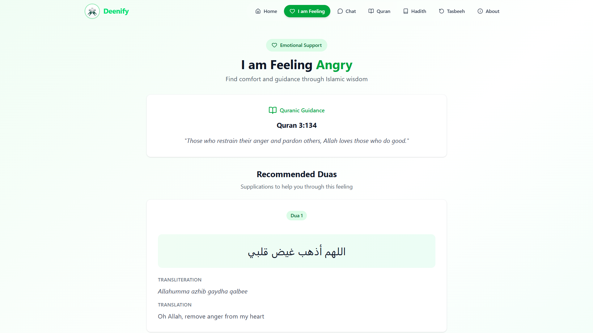
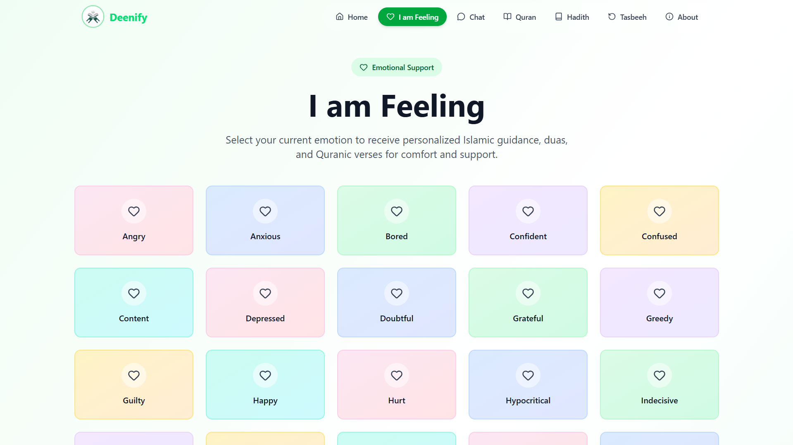

#  Deenify – Your AI Companion for Islamic Knowledge & Emotional Support

**Deenify** is an intelligent Islamic chatbot built with **Next.js** that provides guidance based on the **Qur'an** and **authentic Hadith**. It also offers emotional support by recommending appropriate **duas** based on user feelings.

---

## Features

- Conversational AI with Islamic context
- Answers based only on Qur'an and Sahih Hadith
-  Emotional support with relevant duas via external API
-  Markdown-formatted assistant replies
-  Dark mode friendly UI with Tailwind CSS
-  Secure environment variable usage
-  Deployed on Vercel

---

## Screenshots

---

##  Tech Stack

| Tech       | Description                        |
|------------|------------------------------------|
| Next.js    | React framework for SSR & routing  |
| TypeScript | Static typing                      |
| TailwindCSS| Utility-first UI styling           |

---
## Live

🔗 [Visit Deenify](https://deeenify.vercel.app)